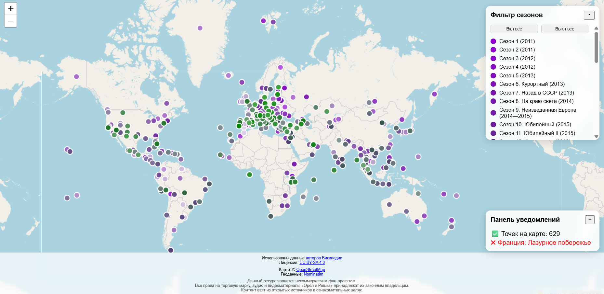
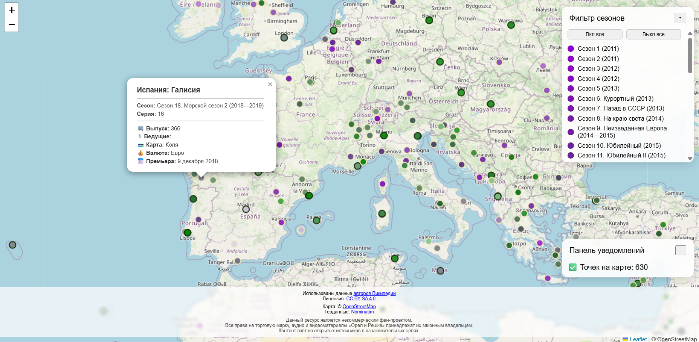

# Орёл и Решка — интерактивная карта выпусков

Небольшой неофициальный проект, визуализирующий географию выпусков телепередачи
«Орёл и Решка» на интерактивной карте мира.

## Examples:






## Источники данных

- **Контент:** Использованы данные [авторов Википедии](https://ru.wikipedia.org/w/index.php?title=Орёл_и_решка_(телепередача)). Распространяется по лицензии [CC BY-SA 4.0](https://creativecommons.org/licenses/by-sa/4.0/deed.ru).

## Используемые технологии

- HTML / CSS / JavaScript
- **Движок карты:** [Leaflet](https://leafletjs.com/)
- **Данные карт:** [OpenStreetMap](https://www.openstreetmap.org/)
- **Геокодирование:** [Nominatim](https://nominatim.openstreetmap.org/)
- **Источник данных:** [Wikipedia API](https://ru.wikipedia.org/w/api.php)

## Атрибуция

© OpenStreetMap contributors  
Поиск координат: Nominatim


## Правовой статус

Данный ресурс является **некоммерческим фан-проектом**. 
- Проект не является официальным сайтом телепередачи.
- Проект не аффилирован с создателями шоу, телеканалами или правообладателями торговой марки «Орёл и Решка».
- Все торговые марки принадлежат их законным владельцам.

## Дополнительная информация

- **Точность данных:** Информация предоставлена исключительно в ознакомительных целях. Данные (координаты, названия, даты) **могут содержать неточности или ошибки**. 


---


### if you want to run local:

```
git clone https://github.com/gmars1/reshka_map.git

cd reshka_map
```

you can make changes in settings file - `./settings.js` (if you want fetch fresh data from wiki, for example)

run server - `py -m http.server 8000` (you have to have python in your system)

go to `http://localhost:8000/`

